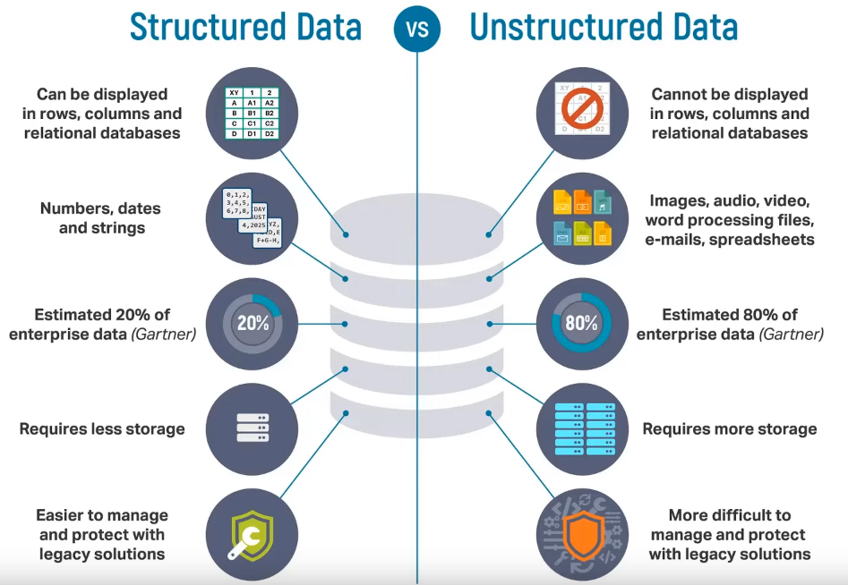

# Types of Data
### Structured Data
* Data that follows a predefined model or schema.
* Data is organized into tables, rows and columns. 
* The relationships between the data elements are clearly defined. 
* Highly structured by rules and constraints set within the database itself. 
* Easily queryable and commonly stored in Relational Databases. 
* Backbone of transactional applications. 
* Examples: spreadsheets, SQL databases, CSV files, Relational tables.
* Around 10% of data. 
### Semi-structured Data
* Data is not neatly structured, but it is not fully unstructured either. 
* Data has some organizational elements to provide some sort of hierarchy through the use of Tags, Keys and Attributes.
* Data does not adhere to a rigid schema, and therefore, there is room for schema evolution. 
* Since the data does not have any structure or rigid schema, any apparent structural format is temporary in nature.
* Semi-structured data is often stored in a series of key-value pairs that are grouped into elements within a file.
* Commonly stored in Non-Relational Databases (No-SQL). 
* Can be stored in CSV, XML or JSON files. 
* For example, rules made in online video game, internet browser cache, social apps that automatically delete posts after certain amount of time. 
* Around 10% of data. 
### Unstructured Data
* Unstructured data is not structured in a consistent way and does not adhere to any schema at all. 
* Some data may have structure similar to semi-structured data, but others may only contain metadata. 
* Takes the form of files or objects. 
* Such data requires preprocessing steps like tagging and cataloging before they can be analyzed meaningfully.
* This preprocessing requirement prevents many businesses from using these in their data analysis solutions.
* Data examples: images, email messages, text files, social media content, text messages, videos. 
* 80% of the data worldwide. 

