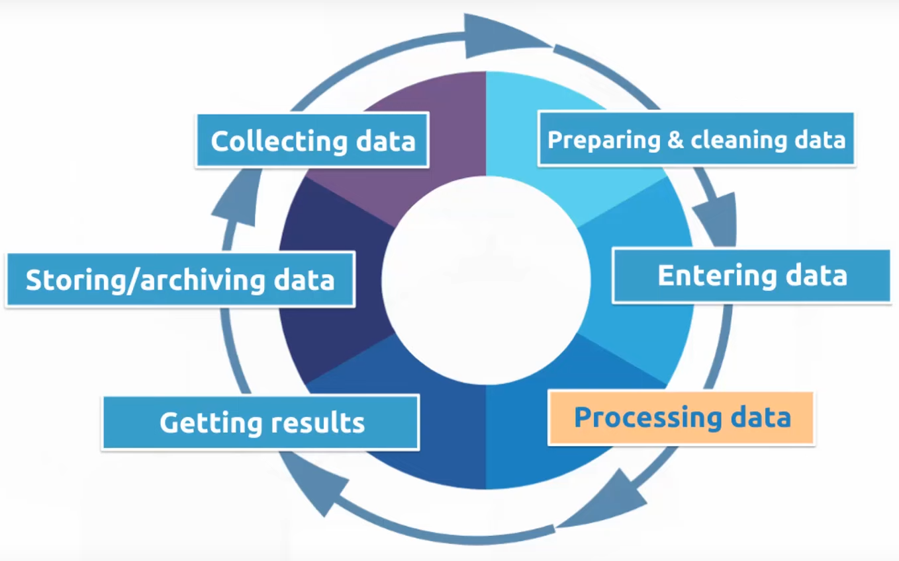

# Velocity of Data

* When businesses need rapid insights from the data they are collecting, but the systems in place simply cannot meet that need, there is a velocity problem. 
* The speed at which the data is being generated is ever-accelerating. This data must be collected, processed, stored and analyzed at high speed.
* We require text messages to be sent and delivered instantly, but we can wait a few minutes for an email. These represent different velocity expectations. 
* The collection and processing of data have been combined into a single concept called data processing. 
* **Data Processing** means the collection and manipulation of data to produce meaningful information. 
* Between collecting and processing data, it is data processing where most of the time will be spent. 

### Batch Processing
* Types:
	* Scheduled
		* The schedule of data processing is predefined and the period covered is uniform. 
		* As such, generally the same amount of data is processed for each period, and workload is predictable. 
		* Also, the velocity is very predictable with scheduled batch processing. 
	* Periodic
		* Happens at random time, and on-demand. 
		* Workload can be unpredictable and hard to plan around. 
		* And just because the requirement for data is periodic, it does not mean that the data processing velocity can be slow. For example, takeoff and landing of airplanes - there is no uniformity in these actions - but when they happen, the data from flight processors and IoT devices on the plane should be available immediately. 
		* Velocity is less predictable with periodic processing. The loss of scheduled events can put a strain on systems and must be considered. 
* In batch processing, latency depends on the size and frequency of the batches. The larger and less frequent the batches are, the higher the latency is. For example, if the data is processed once a day, the latency can be up to 24 hours. 
* Provides deep insights from complex analytics. 
* Once the data has been collected, processing can be done in a controlled environment. There is often time to plan for the appropriate resources. 
* Often a single application\service is used to collect, process and temporarily store data while it is processing. The final step in batch processing is to load the data into analytical data store. 
* AWS EMR could be the service of choice for batch processing. 
* In Batch Analytics, the entire dataset is made available to the Analytical tools. 
* Example: Monthly credit card statements. 

### Stream Processing
* Involves streaming data that are processed regularly and in quick succession in small batches. 
* Types:
	* Near Real-time processing: 
		* Also known as "low-latency" processing. Involves processing the data within a few seconds to a few minutes of delay. 
		* Velocity is of huge concern with near real-time processing. These systems require data to be processed within minutes of the initial collection of the data. 
		* This can put tremendous strain on the processing and analytics systems involved. 
	* Real-time: 
		* Can only have a few milliseconds of delay, if any at all. 
		* Velocity is of paramount concern for real-time processing systems. 
		* Information cannot take minutes or even multiple seconds to process. 
		* It must be processed within seconds to be valid and maintain its usefulness. 
* Provides initial insights and real-time feedback. 
* Collection of the data leads to an immediate need for processing. Depending upon the complexity of the processing (cleansing, scrubbing, curation), this can slow down the velocity of the solution significantly. 
* Multiple services are used to manage stream processing. One service to ingest a constant stream of data, another to process and analyze and further another one to load the data into an analytical data store, if required. 
* AWS services like Kinesis Firehose and Kinesis Data Stream can be used to ingest and load the data into analytical data stores. Kinesis Data Analytics and Lambda function can be used to process and analyze the data streams. 
* Since analytics of stream data is only limited to records collected within that time window. Because of these limitations, analytics on streaming data are often simple aggregates. 
* Example: Text message moments after swapping credit card. This is a streaming data for fraud prevention alert and happens instantaneously. 

### Comparison of Batch and Stream Processing

|             | Batch Processing                                                  | Stream Processing                                                           |
| ----------- | ----------------------------------------------------------------- | --------------------------------------------------------------------------- |
| Scope       | Queries or processing over all or most of the data in the dataset | Queries or processing over data within a rolling time window                |
| Size        | Large batches\bursts of data                                      | Individual records or micro batches\bursts consisting only of a few records |
| Performance | Latencies in minutes to hours                                     | Requires latency in the order of seconds or milliseconds                    |
| Analysis    | Complex analytics                                                 | Simple response functions, aggregates, and rolling metrics                  |

