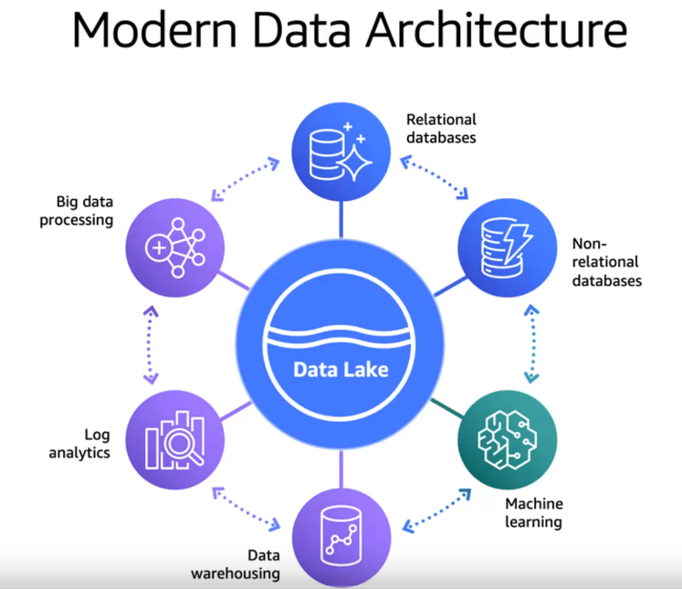
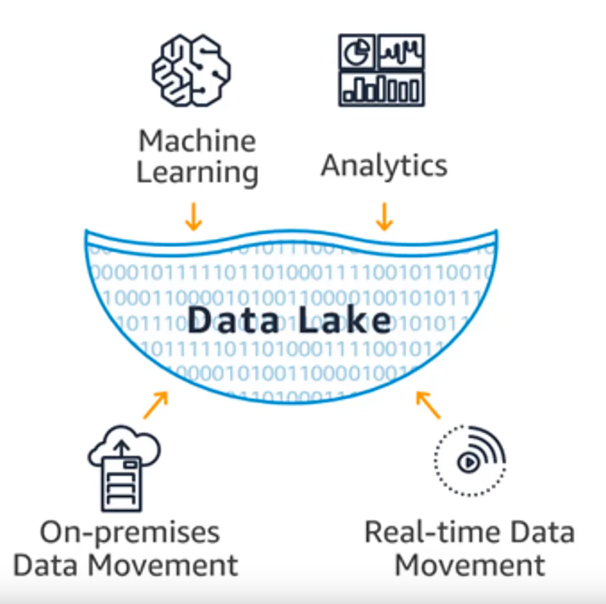
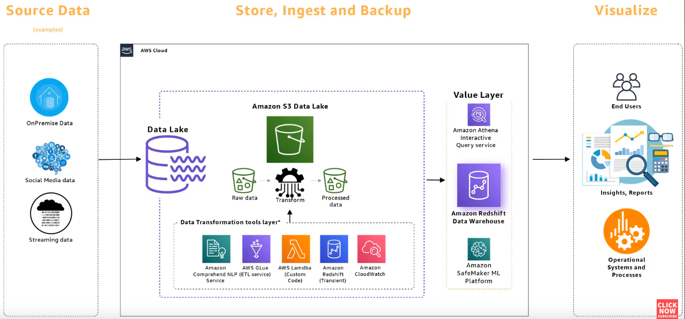
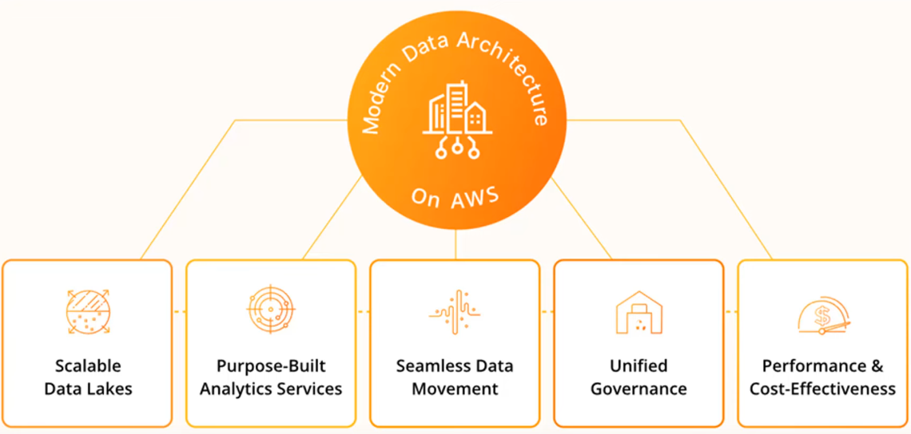

# Data Lake Architecture

## Data Lake

* A Data Lake is centralized repository that allows to store all structured and unstructured data at any scale. 
* it is an architectural concept that keeps the storage layer separated and segregated from the compute layer. 
* No matter how data gets into Amazon S3, there should be a meaningful way to organize it and find it when required. And that is where Data Lake comes in. 
* In other words, data lake takes Amazon S3 buckets and organizes them by categorizing them by data inside the buckets - irrespective of how the data got there or what kind of data it is. 
* * Data lake can store data as-is, without having to first structure the data - unlike the data warehouse that requires data to be organized and structured first. 
* And it also allows to run different types of analytics - from dashboards and visualizations to big data processing, real-time analytics, and machine learning to guide better decisions. 

* 

### Why Data Lake? 
* Many organizations end up grouping data into numerous storage locations called silos.
* These silos are rarely managed and maintained by the same team, and that can be problematic. 
* Inconsistencies in the way the data was written, collected, aggregated or filtered can cause problems when it is compared or combined for processing from different silos. 
* For example, one team can use the Address field to store both the street number and street name, while the other team can use two different fields to store street name and street number. Thus, there is an inconsistency in the way data is stored. 
* But by using data lake, these silos can be broken down and data can be brought into single central repository that is managed by a single team and thus provide single consistent source of truth for the data. 
* Data lake in AWS is a solution that guarantees single repository of data storage in a generally less expensive and less specialized manner than big data storage solutions like Data Warehouse. 
### Benefits of Data Lake
* Store all data in open formats - no special format requirement, unlike databases and data warehouses. 
* Cost-effective way of storing data in a scalable fashion - can be scaled to exabytes. Comparatively storing data in managed databases and data warehouses are expensive. 
* Decouple storage from compute - without having to pay extra for storage - data is already stored in S3. 
* Process data in a single place. 
*  Choice of analytical and ML engines. 

## Data Lake Formation
* AWS provides Data Lake Formation service that helps us build a Data Lake. 
* In AWS Data Lake, S3 makes up the storage layer, along with its high redundancy and high availability. The compute layer is made up of several different services like EMR, GLUE, Lambda. 
* Note: The root user of AWS CANNOT be the administrator of Data Lake. Another user has to be provided necessary permissions (policy) for administering a Data Lake. 