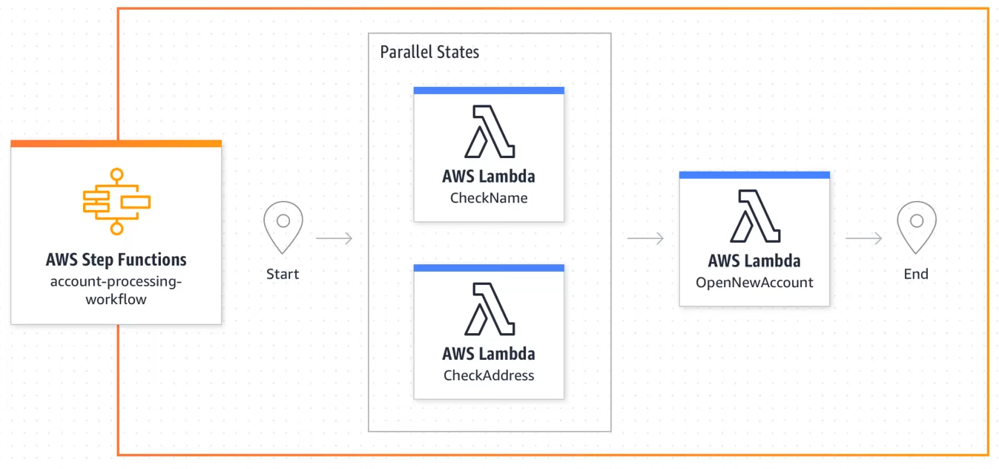
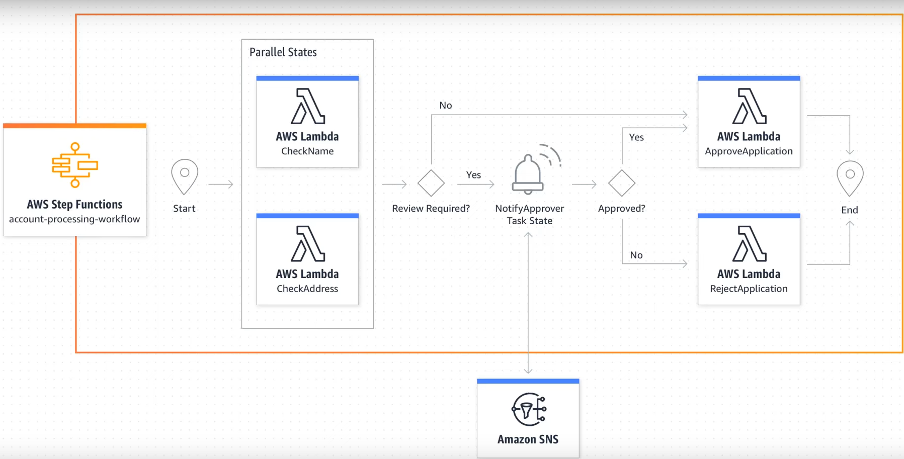
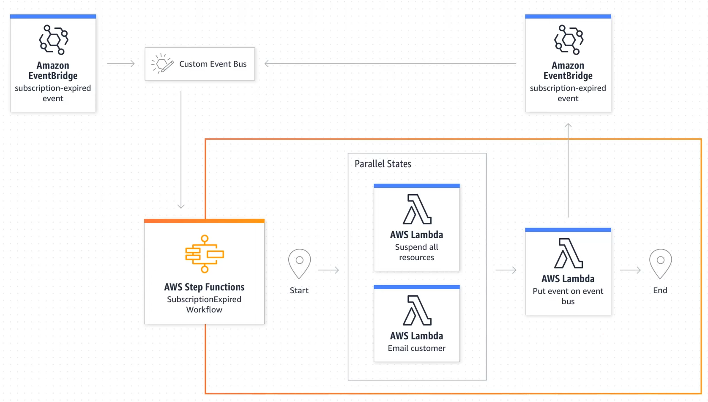
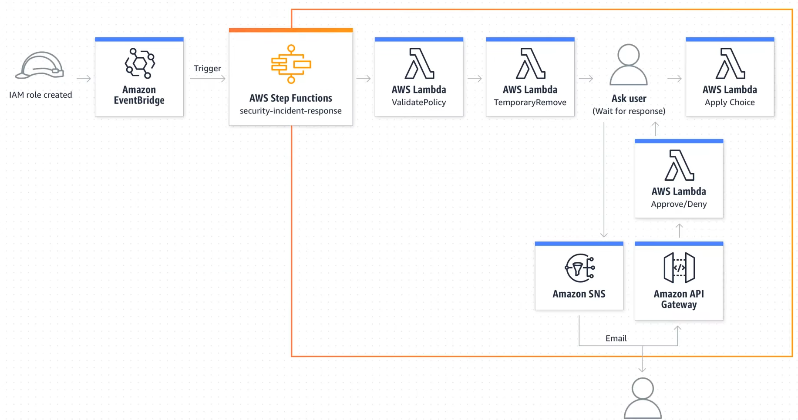
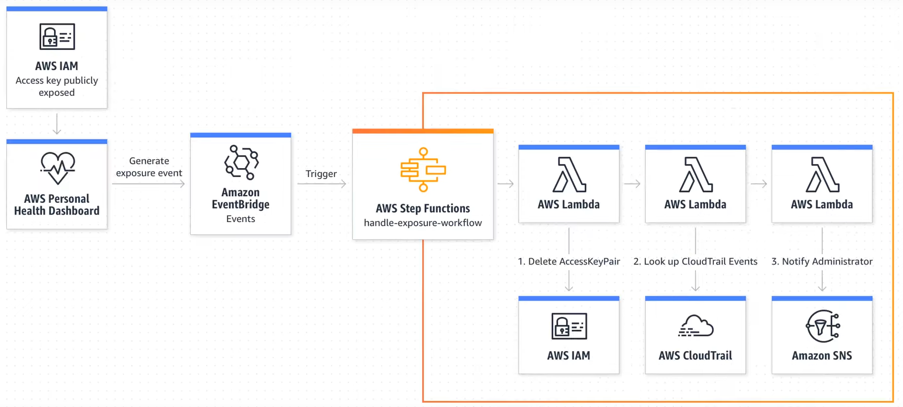

# AWS Step Functions

* AWS Step Functions is an orchestration tool that allows to implement business processes as a series of steps that make up a workflow. 
* Individual steps in the workflow can invoke a lambda function or container that has some business logic. 
* Two workflow options: 
	* Standard
	* Express
* 

