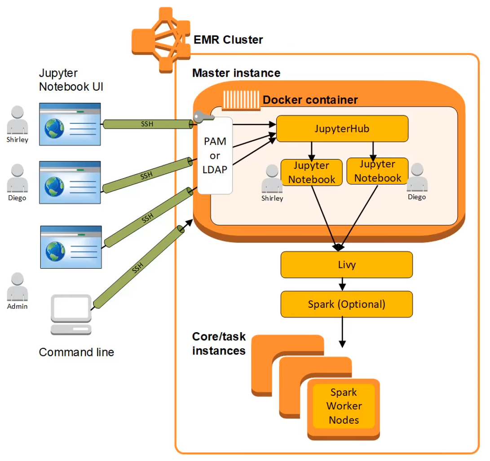

# Amazon EMR

* Amazon EMR is a managed service that works with Hadoop workloads. In addition to running Apache Hadoop framework, it can also run other popular distributed framework such as Apache Spark, HBase, Presto. 
* Amazon EMR Notebook provide serverless development and collaboration environment for one time query and exploratory data analysis. 
* 
* 