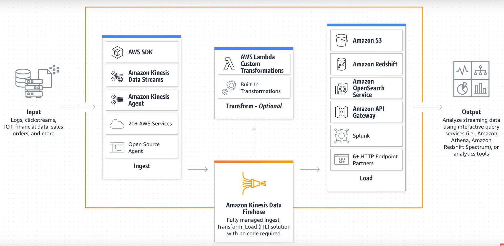
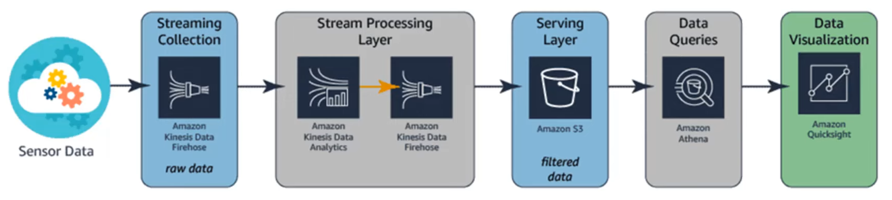
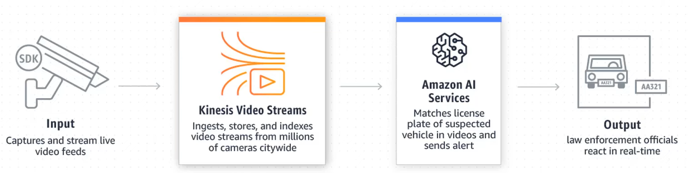

# Stream Data Processing

* Stream data processing is the collection and processing of constant stream of data. 
* The amount of data being transferred and the size of data packets is not always consistent. 
* 
* Necessary features of a Stream Processing Solution: 
	* The primary objective of an stream data processing architectural design is to decouple the data collection system (producer) from the processing system (consumer). Multiple services need to be used for this purpose: 
		* First service to ingest the constant stream of data
		* Second one to process and analyze the ingested stream
		* And one to load the data into analytic data store, if required
	* A streaming solution should also provide a persistent buffer for the incoming data. 
	* Each of the stream producer should also be able to write to the same stream, allowing multiple streams of dispersed data to be combined into a single stream for processing. For example, in an IoT solution, 100s of devices can write to the same endpoint easily. 
	* In stream processing, the ability to preserve the order of data\events is vital. 
	* Parallel consumption of data  is also of vital importance when velocity of data is concerned. This allows multiple consumer applications consume the same stream data simultaneously. 
* Streaming data in AWS is handled by Kinesis. 
* Usage of Streaming Data: 
	* 

## Amazon Kinesis

### Kinesis Firehose

### Kinesis Data Streams

### Kinesis Data Analytics

### Kinesis Video Streams

