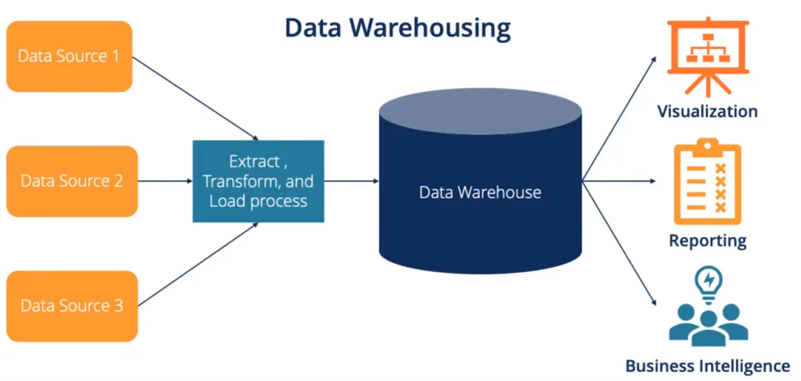

# Data Warehouse

* Data Warehouse is central repository of structured data from many data sources. 
* Due to its centralized nature, it is the main source of truth for analytical purposes. 
* Data is transformed, aggregated and prepared before it is loaded into Data Warehouse (ETL). 
* AWS provides data warehousing service called Amazon Redshift. 

## Amazon Redshift
* Fully managed, petabyte-scale data warehouse service in the cloud. 
* Amazon Redshift Serverless lets us access and analyze data without all of the configurations of a provisioned data warehouse. 
* 

