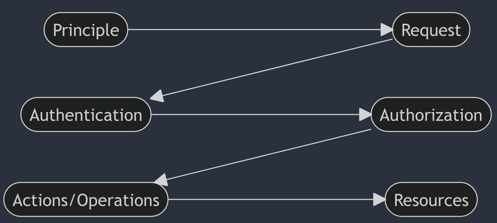

# Identity & Access Management (IAM)

* IAM is a web service that helps us securely control access to AWS resources. 
* Using IAM, user identities (called IAM users) can be created. These IAM users can be assigned custom permission sets (called IAM policies). 
* This allows us to grant each user access only to the services, resources, and information they need to perform their tasks. 
* Each user can also be assigned individualized security credentials, access keys, and multi-factor authentication devices. 
* IAM user can be a person or an application. 
* IAM policies and permissions can also be integrated with directories that we already manage (like Microsoft Active Directory, AWS Directory Service, or an OpenID Connect provider). 
* When we first create an AWS account, we begin with a single sign-in identity that has complete access to all AWS services and resources in the account. This identity is called **AWS account root user**, and it is accessed with the email id and password that was used to create the account. 
* Its not recommended to use the root user for day-to-day tasks, even the administrative ones. 

## Key features of IAM
* Shared access
	* Other people can be granted access and permission to the AWS account - either to administer and\or use resources in our AWS account. 
	* This is done without having to share the root user password or access key. 
* Granular permissions
	* The users granted access can be granted permission on one kind of resource, but not another. 
* MFA
	* Two-factor auth to the account, and to individual users for added security. 
* Identity Federation
	* it also has identity federation. 
* Compliance
	* It also has PCI DSS compliance - supports processing, storage and transmission of credit card transaction data by a merchant provider or service. 

### Accessing IAM
* Management Console
* CLI
	* AWS Command Line Interface
	* AWS Tools for Windows Powershell
* HTTPS API
* SDKs

### Principles of Operation

* Principle:
	* An entity that can make a request for an action or operation on a resource. 
	* Users, Roles, Federated Users and Applications are all AWS Principles. 
	* Account Root User is the first Principle in AWS. 
* Request:
	* Principle sends a Request to AWS. 
	* A Request can include a number of information: 
		* Actions/Operations the Principle wants to perform. 
		* Any Resource object upon which any Action/Operation is to be performed. 
		* The Principle that sent the Request. 
		* Environment data such as IP address, the user agent or if SSL is enabled. 
		* Resource data such as database table, tag, date window. 
	* AWS gathers Request information into a Request context. 
* Authentication: 
	* A Principle must be authenticated into the AWS to send in the Request. 
	* To authenticate from the console as a User, the user must sign in with username and password. 
	* To authenticate from an API or command line, the access key and secret key must be provided. Additional security information may also need to be provided (like when MFA is enabled). 
	* Some services such as S3 allow requests from anonymous users, but these are exceptions and not a norm. 
* Authorization: 
	* AWS uses values from the Request context to check for Policies that apply to the Request. 
	* It then uses the Policies to decide whether to allow or deny the Request. 
* Actions/Operations: 
	* Operations are defined by a service and include things that can be done to or on a Resource.
	* These Operations are usually CRUD operations. 
	* IAM supports about 40 actions for a User Resource - such as creating, editing, deleting the User.
* Resources:
	* After AWS approves the Operations on a Request, these Operations can be performed on the related Resources within the account. 
	* Resource is an object that can exist within a service. For example, EC2 instance is a resource. IAM user is a resource. 
	* It is the service which defines a set of Actions that can be performed on a Resource. 
### Policies
* Most Policies in AWS are stored as JSON documents, and specify the permissions that are allowed or denied for Principles.  
##### Permission Policies
* Policies define permissions to the objects to which they are attached.
* Include:
	* Identity-based policies
	* Resource-based policies
	* ACLs
##### Permission Boundaries
* Advanced feature that allows to use Policies to limit the maximum permissions that a Principle can have. 

### Best Practices
