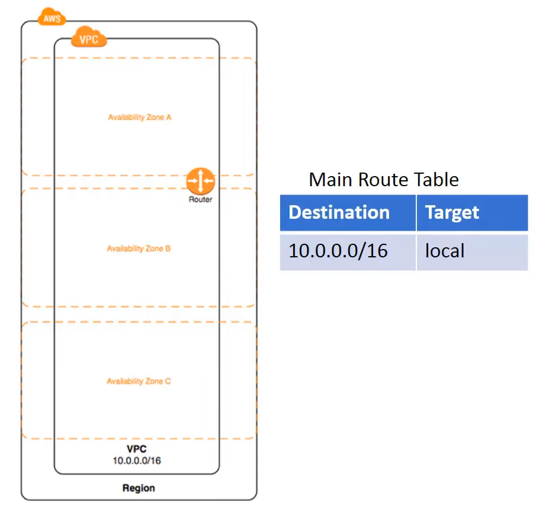

# AWS Virtual Private Cloud (VPC)
* AWS VPC allows to provision a logically isolated section of the AWS Cloud where we can launch AWS resources in a virtual network that we define. We have complete control over the virtual networking environment, including selection of our own IP Address range, creation of subnets, and configuration of route tables and network gateways. 
* Both IPv4 and IPv6 can be used. 
* A public facing subnet can be created for the Web Server that has access to the internet, and backend infra such as databases, app service are kept inside a private subnet with no access to the Internet. 
* Multiple layers of security can be implemented through security groups and Network Access Control Lists (NACLs). 
* A hardware VPN can also be created between corporate data center and the VPCs to leverage AWS as an extension of the corporate data center.  
* Connectivity options for VPC:
	* Direct Internet Connection
	* Multiple VPC Connection
	* Network Address Translation (NAT)
	* Private connection without NAT
	* Secure data center connection
	* AWS PrivateLink
* Some infra limitations:
	* Can add up to 5 non-default VPCs per AWS account per region. 
	* Can add 4 secondary IP ranges. 
	* Can create 200 subnets per VPC. 
	* Can have up to 5 Elastic VPC IP addresses per account per region. 
	* Can have up to 10 hardware VPN connections per VPC. 
* Elastic IP Address: Static IPv4 address (in public domain) designed for dynamic cloud computing. Allows to map the failure of an instance and software by rapidly routing\remapping to other instances (rendundant instances) in the account. Elastic IP Address only support IPv4 and not IPv6. 

## Creating a VPC
* 
* The VPC spans all AZs in the region. 
* Class Inter-Domain Routing (CIDR): 
	* While creating a VPC, a range of IPv4 addresses need to be specified in the form of CIDR block. 
	* CIDR is an IP addressing scheme that improves the allocation of IP addresses. 
	* It replaces the old system based on classes A, B and C. 
	* This scheme also helps greatly extend the life of IPv4, as well as slow the growth of routing tables. 
	* CIDR IP addresses are composed of two parts (10.0.0.0/12): 
		* The network address is written as a prefix, like a normal IP address. 
		* And the second part is a suffix which indicates how many bits are there in the entire address. 
* Subnets:
	* After creating the VPC, one or more subnets can be added in each AZ. 
	* When a subnet is created, a CIDR block can be specified for the subnet - and this CIDR block is the subset of the VPC's CIDR block. 
	* Each subnet resides only within one AZ and cannot span multiple AZs. 
* 

## Different connection types for VPCs
* 
* 
* 

## Two methods of VPN connection
* Border Gateway Protocol (Static Routing)
* AWS Direct Connect
* 