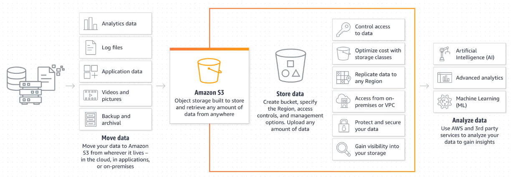
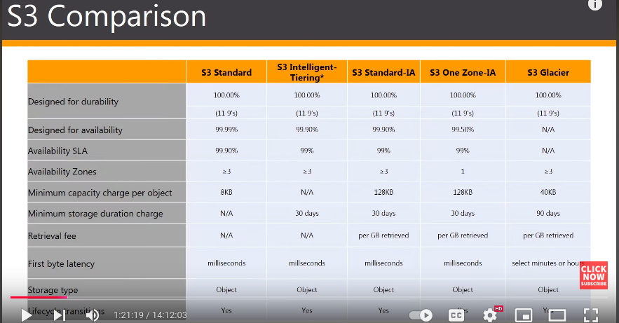

# AWS S3

* AWS has a storage service called **Amazon Simple Storage Service** (Amazon S3). 
* This service is an object storage with industry-leading scalability, data availability, security and performance. 
* Object storage means it can store just about any kind of discrete object in this storage.
* Definitions: 
	* Object: Object is any kind of file that can be stored in the S3. 
	* Bucket: Bucket is a logical container similar to folder in hard drive - but only larger, better organized and with in-built security mechanisms. 
* S3 is an Object based storage class. It cannot be a boot volume and it cannot store applications. 
### Features of S3: 

* Scalable: Can grow to any size required. 
* Durable: Objects will be available when they are needed. Its designed for 99.99999% of data durability. S3 automatically creates and stores replicas of all Objects across multiple system to ensure durability. This enables data to be available when needed and protected against failures, errors and threats. 
* Secure: Provides encryption features and access management controls. 
* Separability: S3 uses Buckets to separate data. Buckets help decouple storage for processing purposes. 
* Parallelization: With S3, any of these storage locations can be accessed at anytime from any process, without negatively impacting the access to other objects. Such accesses happen in parallel. 
* Centralization of storage: Central location to store analytical data. These data become readily available to multiple analytical processes at the same time without the overhead of moving the data between storage and processing systems. 
* Accessibility: Accessibility permissions can be set at Bucket or Object level. 

### Benefits of S3:
* Storage of infinite amount of data
* User permissions
* Buckets for data storage
* Cost-effective
* Low latency

### Buckets
* In summary, S3 stores Objects in Buckets. 
* To look into: Bucket policies, bucket retention policies, bucket security

### Centralized data architecture
* S3 makes it easy to build a multi-tenant environment. 
* That means, many users can build their analytic tools feeding on a common set of data. 
* This feature helps improve both cost and data governance over traditional solutions. Traditional solutions required multiple copies of data to be distributed across multiple platforms. 
* REST APIs can be used to interact with objects in S3. S3 RESTful API is supported by many third party applications like Apache Hadoop. 
* For example, same object can be used by multiple lambda functions at the same time. 

## S3 Storage Classes
* Storage classes can be configured at object level. 
* Thus, a single bucket can contain objects stored across various S3 storage classes.
##### 1. S3 Standard - General Purpose
-  Low latency, high throughput. 
- High durability, availability and performance object storage for frequently accessed data.
- Use cases - cloud application, dynamic websites, content distribution, mobile and gaming applications, big data analytics. 
##### 2. S3 - Intelligent Tiering
* Designed to optimize cost by automatically moving data to the most cost effective tier without performance impact in exchange for a small monthly fee for auto-tiering.  
* It works by storing objects in 3 access tiers: 
	* Frequent Access Tier: 
		* This tier is optimized for frequent access. 
		* This is the default tier since the intelligence automatically adds the object to this tier first. 
	* Infrequent Access Tier: 
		* Tier with infrequent access, optimized for lower cost.
		- Objects that have not been accessed for 30 consecutive days are automatically moved here. 
	- Archive Instant Access Tier: 
		- Used for objects that haven't been accessed for 90 days. 
		- This move is also automatic. 
	- Archive Access Tier: 
		- Optional tier. 
		- Configurable for archiving objects that have not been accessed between 90 to 730 days. 
	- Deep Archive Access Tier: 
		- Another optional configuration that allows intelligent tiering to move data that has not been accessed for anything between 180 to 730 days. 
##### 3. S3 Standard IA
* IA stands for Infrequent Access. 
* This tier is for data that is accessed less frequently, but still requires rapid access when required. 
* It offers high durability, high throughput and low latency of the Standard tier, but with low per GB storage price and per GB retrieval cost. 
* It offers 99.9% availability in multiple zones. 
* Use cases - disaster recovery given that it has a multi-AZ capability, backups. 
##### 4. S3 - One Zone IA
* This tier is for data that is accessed less frequently, but still requires rapid access when required. 
* But in contrast to other tiers which store data in a minimum of 3 availability zones, One Zone IA stores data in a single availability zone only.
* Due to this storage scheme, it costs around 20% less than the Standard IA. 
* This is suitable for users who want lower cost option for storage and also do not need the availability and resilience offered by Standard IA. 
* Due to its single availability, this tier is not fault tolerant.
* It is a good choice for storing secondary backup copies of on-prem data or easily recreatable data. 
* It offers 99.5% availability in a single zone. 
* Use cases - storing secondary backup copies of the data - this does not help much with Disaster Recovery though (since DR relies heavily on having redundancy across multiple zones).
##### 5. S3 Glacier
* Secure, durable and low cost storage tier for archiving data. 
* Can reliably store a large amount of data at costs competitive with or cheaper than on-prem solutions. 
* Glacier provides three data retrieval options: 
	* Instant Retrieval Option:
		* Offers millisecond retrieval.
		* Use cases: 
			* Medical images
			* News media assets
			* Data that needs to be accessed on quarterly basis
	* Flexible Retrieval Option: 
		* Entails storage of data for a minimum of 90 days before it can be either deleted or transitioned to another storage class. 
		* If this condition is not fulfilled, a fee will be incurred for moving or deleting the data. 
		* It comes in 3 flavors: 
			* Expedited: Data retrieval is 1 to 5 minutes. 
			* Standard: Data retrieval is 3 to 5 hours. 
			* Bulk (free): Retrieval times can be longer and less immediate - something between 5 to 12 hours. This option doesn't incur retrieval charges beyond the storage fees. 
	* Deep Archive option: 
		* This option entails a minimum storage duration of 180 days. 
		* Great for long term storage of rarely stored data. 
		* It comes in 2 flavors: 
			* Standard (default): Data retrieval time is 12 hours.
			* Bulk mode: Data retrieval time is 48 hours.
* Objects can be uploaded directly to Glacier storage. 
* Or S3 Life Cycle Policies can be used to transfer data from other storage classes. 

#### Data Retrieval using S3 Select and Glacier Select
* S3 Select can be used to access data in S3 Select-enabled storage classes like Standard and Intelligent-Tiering. 
* Glacier Select is used to retrieve data from Glacier Storage. 
* Both options allow us to use simple SQL statements to retrieve filtered data. 
* Amazon performs server-side filtering which is up to 400% times faster and 80% cheaper - this is because server-side filtering avoids downloading the entire dataset to the client. 

(Image is at 1:22:00)

![[Pasted image 20241211225946.png]]
(Image at 1:33:08)
#### Cross-region replication
* Implemented at Bucket level? Since S3 is at global level. 
* Hands-on practice: 1:25:00-1:40:00

## S3 Versioning
* A version control feature for S3 objects in the same bucket. 
* With this feature enabled, all versions of the object will be stored in S3. 
* S3 keeps track of write and delete operations. 
* When an object is deleted from the S3 bucket, instead of immediately removing it from teh bucket, S3 versioning adds a marker to the object called **Delete Marker** to indicate that the object has been marked for deletion. So, to recover\restore the deleted object, all it requires is to delete this Delete Marker.  
* There are two options for versioning configuration: 
	* Object-Level Versioning - useful for scenarios where versioning requirements vary between objects within the same bucket. Example, versioning may be important for critical files, but not for temporary files and logs. 
	* Bucket-Level Versioning
* Versioning is not charged separately, but only based on storage usage in S3. 
* If versioning is not enabled on an object, its version will be set to NULL. 
* Once enabled, versioning cannot be disabled - it can only be suspended. That means, the existing versions will persist without any impact, but new changes will not be tracked by versioning going forward.  

## S3 Replication
* Replication comes in two flavors:
	* Cross-Region Replication (CRR) - source and replica buckets are in different regions.
	* Same-Region Replicaiton (SRR) - source and replica buckets are in the same region.
* Use cases of CRR: 
	* Disaster Recovery: Enhances availability by allowing to failover to a secondary region if the primary region experiences an outage. 
	* Compliance and Geo-Redundancy: Some regulatory requirements mandates storing the data in specific regions. Data is replicated in the compliant region, in addition to its sourcing in the local region. 
	* Reduced Latency: CRR can improve read performance by allowing applications to retrieve objects from a replicated bucket that is geograpahically closer to the end-users. 
* Use cases of SRR: 
	* Disaster Recovery within a Single-AZ: Enhances availability by allowing to failover to a secondary bucket within the same Availability Zone. 
	* Testing: SRR can be leveraged for live near real-time replication between production and test systems. 
	* Caching: SRR can be leveraged to replicate the frequently accessed contents into a caching layer 
* Types of Replication (criteria - speed of replication): 
	* Asynchronous replication: 
		* Only copies the objects from primary bucket to the replica bucket only after the data has already been written into the primary bucket. 
		* Offers near real-time replication, but not actual real-time replication. 
	* Synchronous replication: 
		* Copies the objects to the replica bucket, while they are actively being written to the primary bucket. 
		* This approach enables real-time replication. 
* S3 replication operates asynchronously - only near real-time replication is supported. 
* To get started with Replication, Versioning feature needs to be enabled in both source and destination buckets. Also, proper IAM permissions should be granted to S3 bucket. 
* Turning replication on won't automatically replicate the existing objects in the bucket. Replication will only apply to newly added objects there on after. 
* To replicate the existing objects or the objects that fail to replicate, S3 Batch Replication should be used. 

## S3 Event Notification
* This feature allows to configure S3 to notify when certain events take place. 
* These events include:
	* Creating new objects
	* Removing objects
	* Restoring objects
	* Replicating objects
	* Expired S3 lifecycle events
	* Transitioned S3 lifecycle events
	* Automatic archival events from S3 Intelligent-Tiering
	* Tagging objects
	* PUT ACL objects
* Usually takes a few seconds for the notification to be triggered and sent. 
* Notifications can be forwarded to services such as:
	* Amazon SNS
	* Amazon SQS
	* AWS Lambda functions
	* AWS Event Bridge - in turn can send these notifications to various other services. 
