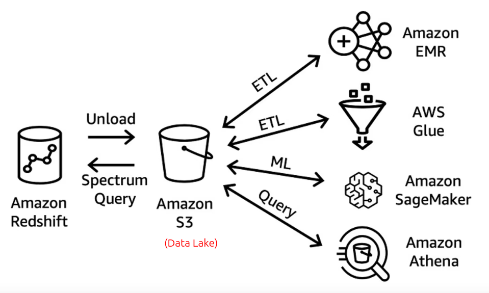
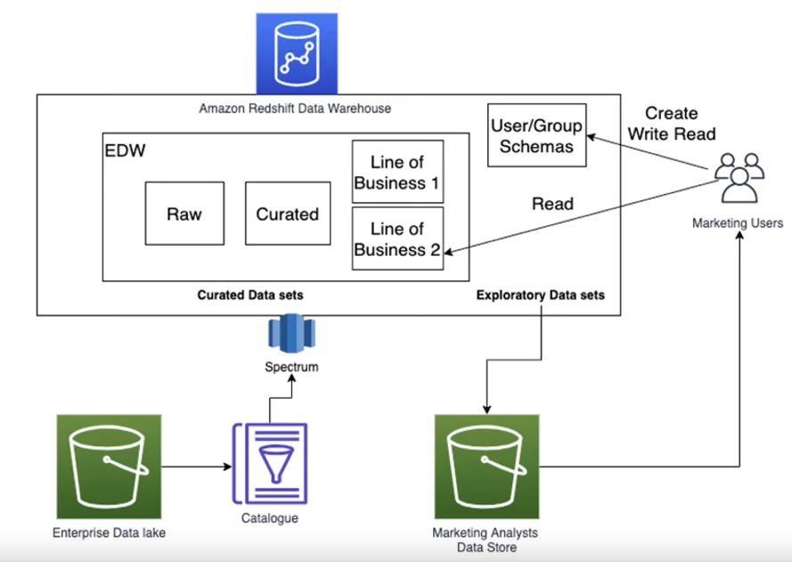
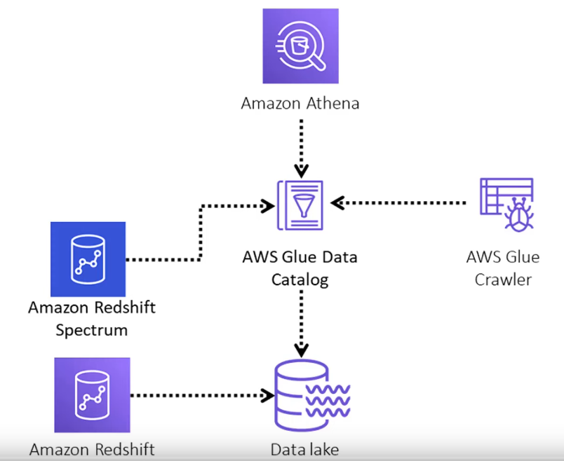

# Storage

Contents: 
- [Storage options in AWS](#storage-options-in-aws)
- [Data Lake vs Data Warehouse](#data-lake-vs-data-warehouse)

---
## Storage options in AWS

### Storing objects - without analytical capability
* Simple Storage Service (S3)
* Elastic Block Storage (EBS)
* Elastic File System (EFS)
* Glacier
* Storage Gateway

### Data Lake
* Recommended option for storing massive volume of semi-structured and unstructured data for analytical purpose. 

### Data Warehouse
* Recommended option for storing massive volume of structured data for analytical purpose. 

## Data Lake vs Data Warehouse

|                     | Data Lake                                                                        | Data Warehouse                                                |
| ------------------- | -------------------------------------------------------------------------------- | ------------------------------------------------------------- |
| Type of data stored | All kinds - mostly semi-structured and unstructured - like objects in S3 buckets | Only structured data in tabular format, with rows and columns |
| Schema              | Schema is not defined                                                            | Schema is defined beforehand                                  |
|                     |                                                                                  |                                                               |

## Amazon Redshift Spectrum
* Amazon Redshift Spectrum allows us to combine Data Lake and Data Warehouse as if it were a single source of data. 
* It allows to run single query across exabytes of data irrespective of where it comes from - data lake or data warehouse. 

