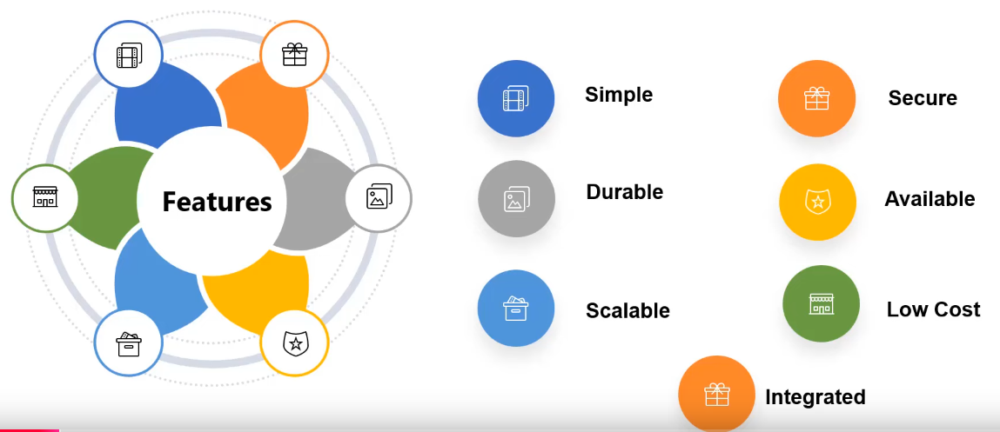
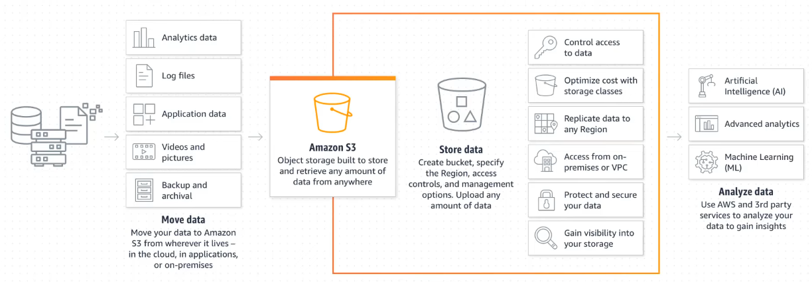
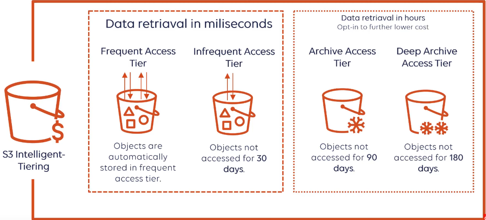
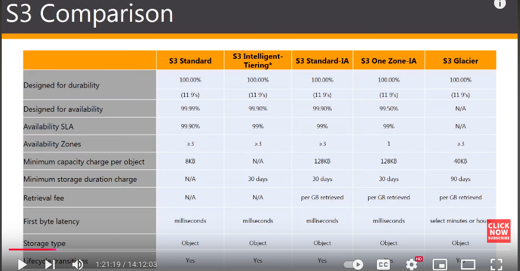

# Storage

## Storage options in AWS
* Simple Storage Service (S3)
* Elastic Block Storage (EBS)
* Elastic File System (EFS)
* Glacier
* Storage Gateway

## AWS S3

* AWS has a storage service called **Amazon Simple Storage Service** (Amazon S3). 
* This service is an object storage with industry-leading scalability, data availability, security and performance. 
* Object storage means it can store just about any kind of discrete object in this storage.
* Definitions: 
	* Object: Object is any kind of file that can be stored in the S3. 
	* Bucket: Bucket is a logical container similar to folder in hard drive - but only larger, better organized and with in-built security mechanisms. 
* S3 is an Object based storage class. It cannot be a boot volume and it cannot store applications. 
* Features of S3: 
	* Scalable: Can grow to any size required. 
	* Durable: Objects will be available when they are needed. Its designed for 99.99999% of data durability. S3 automatically creates and stores replicas of all Objects across multiple system to ensure durability. This enables data to be available when needed and protected against failures, errors and threats. 
	* Secure: Provides encryption features and access management controls. 
	* Separability: S3 uses Buckets to separate data. Buckets help decouple storage for processing purposes. 
	* Parallelization: With S3, any of these storage locations can be accessed at anytime from any process, without negatively impacting the access to other objects. Such accesses happen in parallel. 
	* Centralization of storage: Central location to store analytical data. These data become readily available to multiple analytical processes at the same time without the overhead of moving the data between storage and processing systems. 
	* Accessibility: Accessibility permissions can be set at Bucket or Object level. 
* Benefits of S3:
	* Storage of infinite amount of data
	* User permissions
	* Buckets for data storage
	* Cost-effective
	* Low latency

### Buckets
* In summary, S3 stores Objects in Buckets. 
* To look into: Bucket policies, bucket retention policies, bucket security

### Centralized data architecture
* S3 makes it easy to build a multi-tenant environment. 
* That means, many users can build their analytic tools feeding on a common set of data. 
* This feature helps improve both cost and data governance over traditional solutions. Traditional solutions required multiple copies of data to be distributed across multiple platforms. 
* REST APIs can be used to interact with objects in S3. S3 RESTful API is supported by many third party applications like Apache Hadoop. 
* For example, same object can be used by multiple lambda functions at the same time. 

### S3 Storage Classes
* Storage classes can be configured at object level. 
* Thus, a single bucket can contain objects stored across various S3 storage classes.
##### S3 Standard
- High durability, availability and performance object storage for frequently accessed data.
- Low latency, high throughput. 
- Use cases - cloud application, dynamic websites, content distribution, mobile and gaming applications, big data analytics. 
##### S3 - Intelligent Tiering
* Designed to optimize cost by automatically moving data to the most cost effective tier without performance impact or operational overhead. 
* It works by storing objects in 2 access tiers: 
	* One tier is optimized for frequent access
	* Another tier with in-frequent access optimized for lower cost
##### S3 - Standard IA
* IA stands for Infrequent Access. 
* This tier is for data that is accessed less frequently, but still requires rapid access when required. 
* It offers high durability, high throughput and low latency of the Standard tier, but with low per GB storage price and per GB retrieval cost. 
##### S3 - One Zone IA
* This tier is for data that is accessed less frequently, but still requires rapid access when required. 
* But in contrast to other tiers which store data in a minimum of 3 availability zones, One Zone IA stores data in a single availability zone only.
* Due to this storage scheme, it costs around 20% less than the Standard IA. 
* This is suitable for users who want lower cost option for storage and also do not need the availability and resilience offered by Standard IA. 
* Due to its single availability, this tier is not fault tolerant.
* It is a good choice for storing secondary backup copies of on-prem data or easily recreatable data. 
##### S3 Glacier
* Secure, durable and low cost storage tier for archiving data. 
* Can reliably store a large amount of data at costs competitive with or cheaper than on-prem solutions. 
* Glacier provides three data retrieval options: 
	* **Look this up**
* Objects can be uploaded directly to Glacier storage. 
* Or S3 Life Cycle Policies can be used to transfer data from other storage classes. 

(Image is at 1:22:00)

![[Pasted image 20241211225946.png]]
(Image at 1:33:08)
#### Cross-region replication
* Implemented at Bucket level? Since S3 is at global level. 
* Hands-on practice: 1:25:00-1:40:00