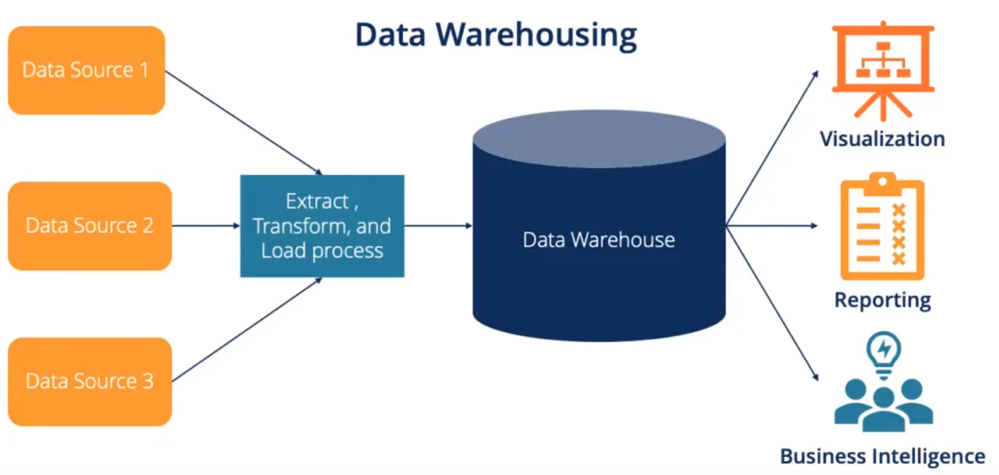
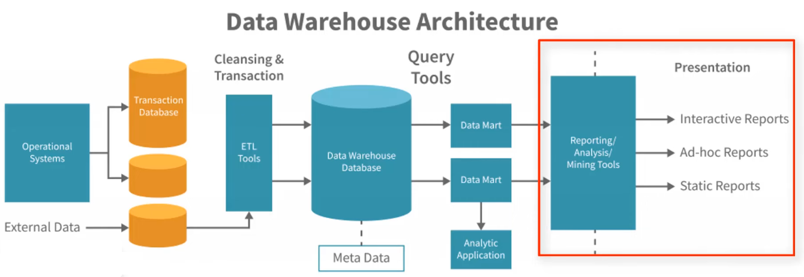
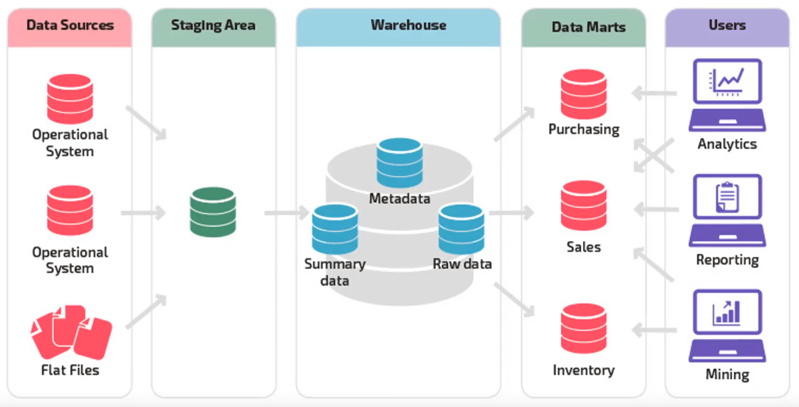

# Data Warehouse

* Data Warehouse is central repository of structured data from many data sources. 
* Due to its centralized nature, it is the main source of truth for analytical purposes. 
* Data is transformed, aggregated and prepared before it is loaded into Data Warehouse (ETL). 
* Data is stored within Data Warehouse using a schema. 
* AWS provides data warehousing service called Amazon Redshift. 

## Data Warehouse Schema
* Schema defines how data is stored within tables, columns and rows, and how different tables are related to each other. 
* Schema is a description - represented by objects such as tables and indexes - of how data relates logically within a data warehouse. 
* Schema also enforces constraints on the data to ensure the integrity of the data. 
* Star, galaxy, and snowflake schema are types of warehouse schema that describe different logical arrangements of data. 
* Transformation of data is required to ensure that the source data confirms to the schema. 

## Data Warehouse Architecture

## Data Mart
* A subset of data from the data warehouse is called Data Mart, which offers fast access and easy implementation of analytical tasks. 
* A data mart only focuses on one subject or one functional area. 
* Data warehouses can be massive - since it centralizes data for the whole enterprise.  Access and analysis of this huge volume of data can be challenging. So, departments need a way to limit access to only the data most relevant to the departmental analytical users. 
* Thus, a data mart is a data warehouse of a subset of data warehouse that serves the needs of a specific business unit, like a company's finance, marketing, or sales department. 
* Amazon Redshift also allows to configure data marts. 

## Amazon Redshift
* Fully managed, secure, scalable ( to petabyte-scale) data warehouse service in the cloud. 
* Amazon Redshift Serverless lets us access and analyze data without all of the configurations of a provisioned data warehouse. 
* 

