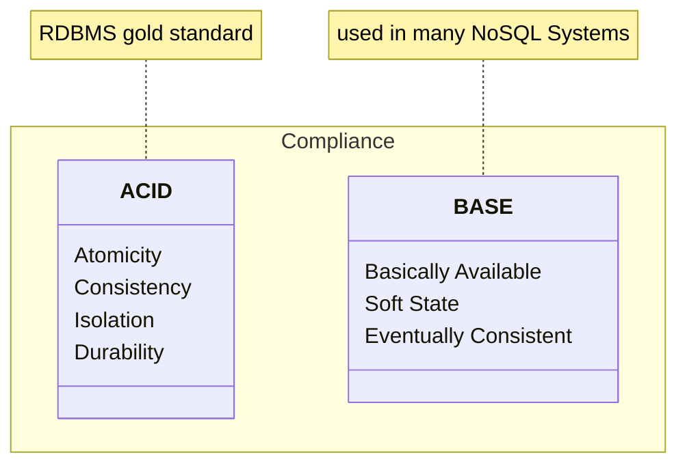

# Databases

```mermaid
	classDiagram
	namespace Compliance {
		class ACID {
			Atomicity
			Consistency
			Isolation
			Durability
		}
		class BASE {
			Basically Available
			Soft State
			Eventually Consistent
		}
	}
	note for ACID "RDBMS gold standard"
	note for BASE "used in many NoSQL Systems"
```
