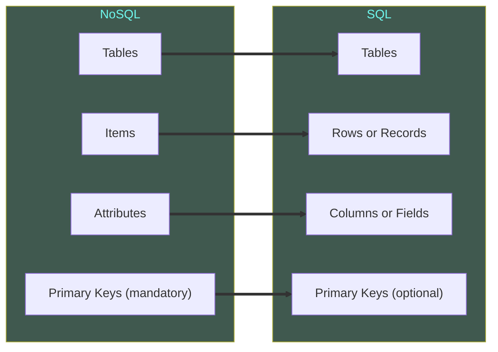

# Amazon DynamoDB

* Fully managed NoSQL Database Service that provides fast and predictable performance with seamless scalability. 
* Supports both key-value pairs, as well as document data like JSON, HTML & XML. 
* Allows to easily adapt the tables as the requirements change. 
* But as a trade-off to maintaining this flexibility, it has to sacrifice the ability to perform joins and analytical queries. 
* Also, access patterns must be known ahead of table creation. 
* Offers Encryption-at-rest that helps to protect sensitive data. 
* Use cases: 
	* Media and Metadata stores.
	* Online Transaction Processing (OLTP) workloads: Retail and Shopping experiences - applications experiencing high traffic, especially during peak times (such as sale events, holidays).
	* Large scale gaming platforms: High throughput traffic with massive amount of data payload. 
	* Data with hierarchical structure: Employee tables, department structures, organizational charts. 
	* Fluctuating workloads: Autoscaling features makes it great for applications whose database workload varies significantly by time of day. For example, social media users that have varying user activity levels throughout the day or e-commerce sites with flash sales. 
	* Low-latency applications: Mission-critical applications that can't afford downtime. DynamoDB is designed to offer high availability and fault tolerance, making it suitable for applications that require continuous operation such as health care systems and online banking applications. 

### Components of DynamoDB
1. Tables, Items and Attributes: Tables are similar to other DB systems. DynamoDB stores data in tables, which is basically collection of data. Each table contains 0 or more items, which is a group of attributes which is uniquely identifiable among all other items. An attribute is a fundamental data element, something that does not need to be broken down any further. 
2. Primary Key: Primary key uniquely identifies each item in the table. It supports a partition key and a partition and sort key. 
3. Secondary Indexes: One or more secondary indexes can be created on a table, that lets us query the data in the table using an alternate key in addition to queries against the primary key. DynamoDB does not require an index, but an index offers more flexibility and performance enhancement when querying. 
4. DynamoDB Streams: An optional feature that captures data modification events in the DynamoDB tables. The data about these events occur in near-real time, in order of their occurrence.  
5. Eventually Consistent and Strongly Consistent Reads: Eventually Consistent means there will be bit of a lag in terms of consistency between replicas. Strongly Consistent means the data will be replicated within milliseconds. 

### Features of DynamoDB
* Provides unlimited storage size. 
* It is really fast - single-digit millisecond latency at any scale. Latency is less than microsecond with DynamoDB Accelerator (DAX).
* Automatic Replication: Fully synchronizes the data automatically across all availability zones (all means 3) within the region in which the tables are created, thereby providing high built-in availability. 
* DynamoDB Global Tables: allows to replicate data across different AWS regions which enables fast and responsive user access for globally distributed applications. 
* DynamoDB Streams: captures time-ordered sequence of all the modifications in the database table on an item-level. It does this by maintaining a time-ordered list of all the modifications made on the table, like stream record added or updated. 
* Partitioning: DynamoDB distributes data across partitions without the need for manual handling of partitioning. 
* Integrates very easily with other AWS services such as EMR. 
* Can easily move data to a Hadoop cluster in the EMR. 

### DynamoDB Building Blocks

* Data elements stored in the table make up attributes. 
* A unique group of attributes will give an item. Its worth noting that a single item cannot exceed 400KB in DynamoDB. 
* Primary key: 
	* A mandatory key made of one or more attributes. 
	* Primary key is used to retrieve the data. 
	* This is why knowing access patterns is essential in the table design. 
* Time to Live (TTL) feature: 
	* If TTL attribute is added to the table items, it will act as a timestamp that will be used to tell DynamoDB when to start getting rid of items. 
	* DynamoDB compares current time to the value of TTL key in an item. If the current time is greater than the item's TTL value, then the item is marked for deletion. 
	* DynamoDB then automatically removes the expired items from the tables, and indexes - including Local Secondary Indexes  (LSIs) and Global Secondary Indexes (GSIs) - within 48 hours of expiration. 
	* Since the expired item is not deleted immediately, result set of queries might return this item as well. Filter operations to exclude items marked for deletion should be used to avoid this occurrence. 

### RDS vs DynamoDB
| Characterstic     | Relational DBMS                                                                                                                                                                                                                                                                    | Amazon DynamoDB                                                                                                                                                                                                                                                                                                                                                     |
| ----------------- | ---------------------------------------------------------------------------------------------------------------------------------------------------------------------------------------------------------------------------------------------------------------------------------- | ------------------------------------------------------------------------------------------------------------------------------------------------------------------------------------------------------------------------------------------------------------------------------------------------------------------------------------------------------------------- |
| Optimal Workloads | Ad hoc queries; data warehousing; OLAP.                                                                                                                                                                                                                                            | Web-scale applications including social networks, gaming, media sharing, and IoT.                                                                                                                                                                                                                                                                                   |
| Data Model        | Requires a well-defined schema, where data is normalized into tables, rows and columns. All relationships are defined among tables, columns, indexes and other DB elements.                                                                                                        | Schemaless. Every table must have a primary key to uniquely identify each data item, but there are no similar constraints on other non-key attributes. Can manage structured or semi-structured data (like JSON documents).                                                                                                                                         |
| Data Access       | SQL is the standard for storing and retrieving data. Relational DB offers a rich set of tools for simplifying the development of database-driven applications, but all of these tools use SQL.                                                                                     | AWS Management Console or AWS CLI can be used to work with DynamoDB and perform ad hoc tasks. Applications can leverage AWS SDKs to work with DynamoDB using object-based, document-centric, or low-level interfaces.                                                                                                                                               |
| Performance       | Relational DBs are optimized for storage, so performance generally depends on the disk subsystem. Developers and DBAs must optimize queries, indexes and table structures to achieve peak performance.                                                                             | DynamoDB is optimized for compute, so performance is mainly the function of the underlying hardware and network latency. As a managed service, DynamoDB insulates applications from implementations details, so that high-performance application can be designed and built.                                                                                        |
| Scaling           | It is easiest to scale up with faster hardware. It is also possible for DB tables to span across multiple hosts in a distributed system with additional investment. Relational DBs have maximum sizes for the number and size of files, which imposes upper limits on scalability. | DynamoDB is designed to scale out using distributed clusters of hardware. This design allows increased throughput without increased latency. Customers specify their throughput requirements, and DynamoDB allocates sufficient resources to meet those requirements. There are no upper limits on the number of items per table, nor the total size of that table. |

### Throughput
* Throughput capacity of DynamoDB depends on one of the two read or write capacity modes: 
	* Provisioned Capacity Mode
		* Allows to calculate and provision throughput using capacity units
			* Read capacity units (RCUs)
			* Write capacity units (WCUs)
	* On-demand Capacity Mode
		* Pre-determined throughput specification is not required as DynamoDB charges in terms of request units. Charged in terms of: 
			* Read request units (RRUs)
			* Write request units (WRUs)
* Both capacity modes have a maximum throughput limit of 40,000 RCU/RRU per table and 40,000 WCU/WRU per table. 
* What happens when throughput capacity is under-provisioned?
	* When the consumed capacity becomes greater than provisioned capacity, database will throttle and throw the *ProvisionedThroughputExceededException*. 
	* This is where Burst Capacity comes to the rescue: 
		* It occasionally provides bursts or spikes. 
		* As a result, read and write requests that would typically throttle end up succeeding. 
		* When throughput for a given partition is not fully used, DynamoDB retains upto 5 minutes (300 seconds) of that unused capacity for later use. And this is the source of Burst Capacity. 
* One method to address over- or under-provisioning is to use AWS Application Auto Scaling - this will adjust the provisioned throughput and allow to meet the surge traffic. 
* As a workaround, retry logic can also be implemented in the application code if something is going to fail a couple of times. 
	* In DynamoDB **exponential backoff** is a specific strategy used in retry logic. 
	* It determines the time delay between retries. 
* 

| Provisioned Capacity Mode                                                                                                                                              | On-demand Capacity Mode                                                                                                                                                                                                           |
| ---------------------------------------------------------------------------------------------------------------------------------------------------------------------- | --------------------------------------------------------------------------------------------------------------------------------------------------------------------------------------------------------------------------------- |
| Provides **consistent** and **predictable** performance                                                                                                                | Database automatically scales according to demand                                                                                                                                                                                 |
| Pricing is determined by provisioned throughput capacity - Over-provisioning risks unnecessary charges - Under-provisioning risks being subject to throttling    | Follows a **pay-as-you-go** pricing model and is more expensive per request than provisioned - No risk of over- or under-provisioning - Only subject to throttling if the previous peak is exceeded by 2x within 30 minutes |
| Suitable for applications with:  - Predictable traffic and capacity needs - Consistent traffic that ramps gradually over time                                    | Suitable for applications with:  - Unpredictable traffic and capacity - New tables with unknown workloads                                                                                                                   |
| Scaling options:  - Enable auto-scaling and define min and max capacity units to control costs - Disable auto-scaling and only define provisioned capacity units | No capacity and scaling planning is needed - Just need to make API calls - Idle tables are only charged for storage and backups but not for read/write operations                                                           |
| Switch any time to provisioned once the app has gained steady state                                                                                                    | Switch to on-demand if the app experiences a lot of fluctuations - Can only switch to on-demand mode once every 24 hours                                                                                                       |

### PartiQL
* Allows to use SQL-like syntax to interact with DynamoDB tables. 
* Supports most of the SQL statements like INSERT, UPDATE, SELECT, DELETE. 
* Output can be obtained either in Table view format or JSON view format. 
* Can be accessed from DynamoDB console, AWS Command Line Interface, DynamoDB APIs and NoSQL Workbench. 
* Potential drawbacks: 
	* PartiQL queries don't always get translated into efficient DynamoDB API operations. 

