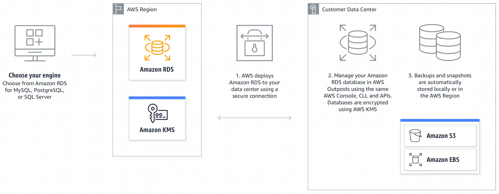

# Amazon Relational Database Service (RDS)

* Service to set up, operate and scale a relational database in the cloud.
* It provides cost-efficiency and re-sizable capacity while automating time consuming administrative tasks like hardware provisioning, database setup, updates, patching and backups. 
* RDS is available on several database instance types - either for optimized memory or performance or I\O. 
* It also provides from 6 familiar database engines to choose from - PostgreSQL, MySQL, MariaDB, Oracle, MS SQL Server, Amazon Aurora. 
* Amazon also provides a migration service that facilitates migrating or replicating an existing database (on-prem or cloud) to RDS. 
* Additionally, RDS also provides Amazon CloudWatch (monitoring and metrics) for the database instances at no additional charge. 

### Benefits of RDS
1. Easy to administer: Makes it easy to go from conceptual project to implementation. Production-ready relational database can be spun up in a matter of minutes. 
2. Highly scalable: Like most other AWS Services, RDS is also scalable since it utilizes the global infrastructure that AWS has.
3. Available and Durable
4. Extremely Fast: Offers two SSD backed storage options - one optimized for high performance (for OLTP applications) and another for cost effective general purpose use. 
5. Secure: Easy to control network access to the database. RDS runs the database instances in Virtual Private Cloud (VPC) which enables us to isolate the database instances and to connect to existing IT infrastructure through an industry standard encrypted IPSec VPN. Encryption-at-rest and Encryption-at-transit is offered.  
6. Inexpensive: On-demand pricing facilitates to pay only for the resources being consumed. On-demand pricing also does not demand any upfront cost or long-term commitments. Lower hourly rates are offered if Reserved-instance pricing is utilized. 

